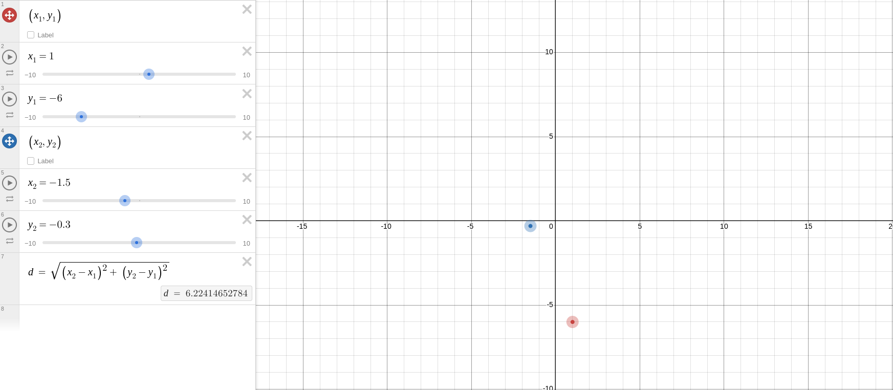

# Instructions
**Objective:** Use input and math expressions to calculate the distance between two points.

## Background information 
The distance between two points $(x_1, y_1)$ and $(x_2, y_2)$ can be calculated using the following formula:

$$d = \sqrt{(x_2 - x_1)^2 + (y_2 - y_1)^2}$$

See this [graph](https://www.desmos.com/calculator/eopojbx1ng) for a visual.


## Instructions
1. Take input for `x_1`, `y_1`, `x_2`, and `y_2`. What data type should they be? How will you prompt the user to enter input?
2. Given the inputs, calculate the distance between the two points. What library do you need for the square root?
3. Output the distance between the points to 3 decimal places.

## Test cases
### Case 1
```
Point 1: (x_1, y_1):
x_1: 3
y_1: 2

Point 1: (x_2, y_2):
x_2: 9
y_2: 1
The distance between points (3, 2) and (9, 1) is 6.083
```

## Case 2
```
Point 1: (x_1, y_1):
x_1: -2
y_1: -0.5

Point 1: (x_2, y_2):
x_2: 2
y_2: 4
The distance between points (-2, -0.5) and (2, 4) is 6.021
```